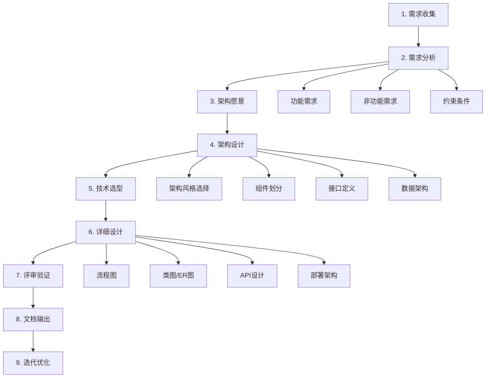
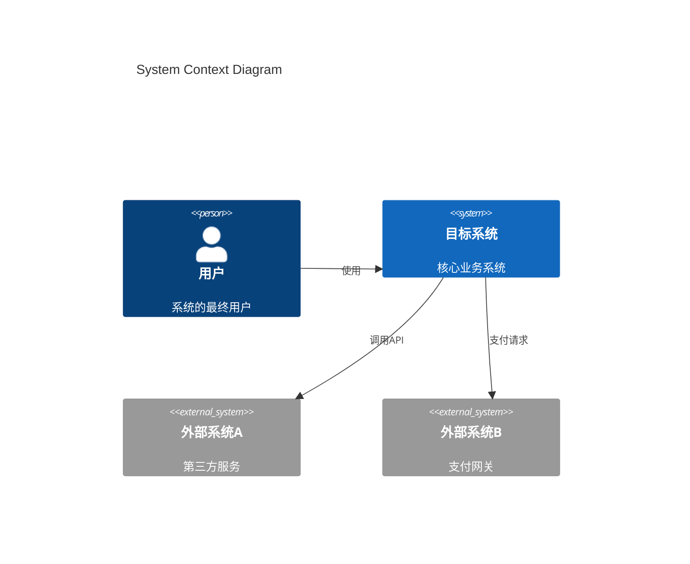
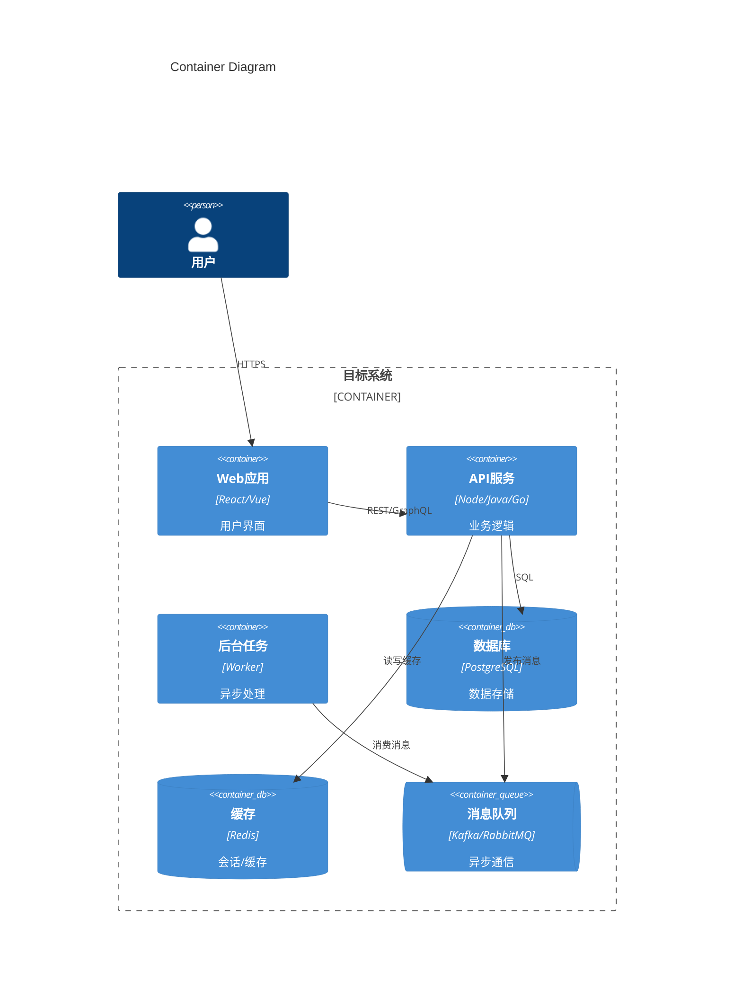
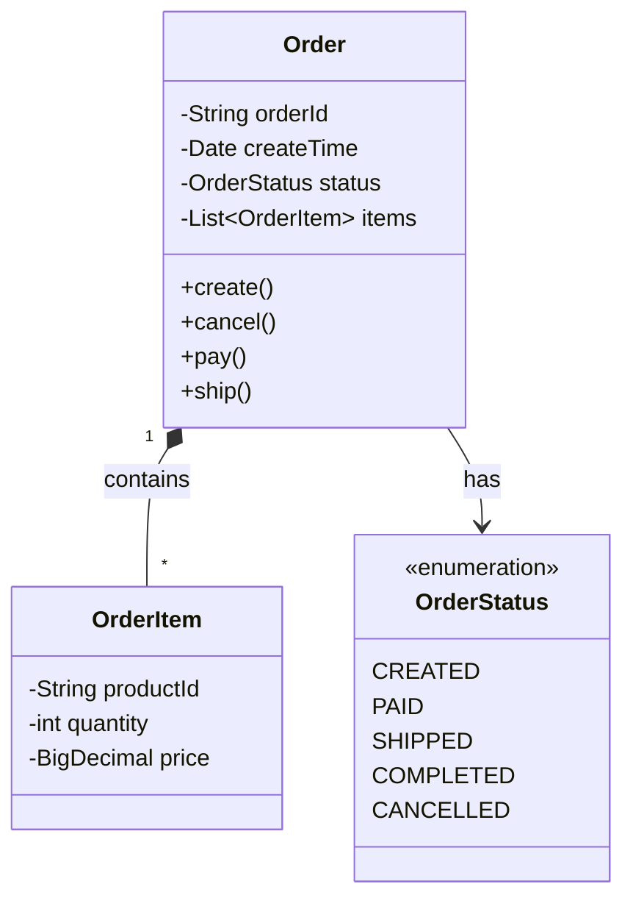
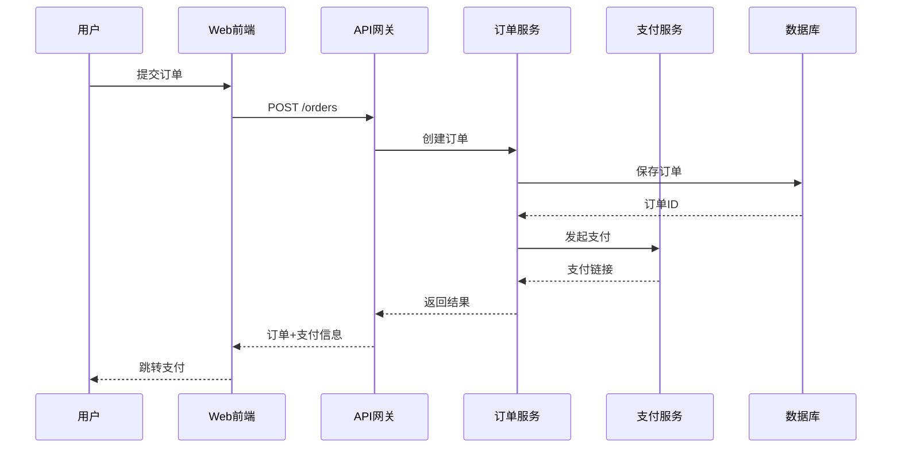
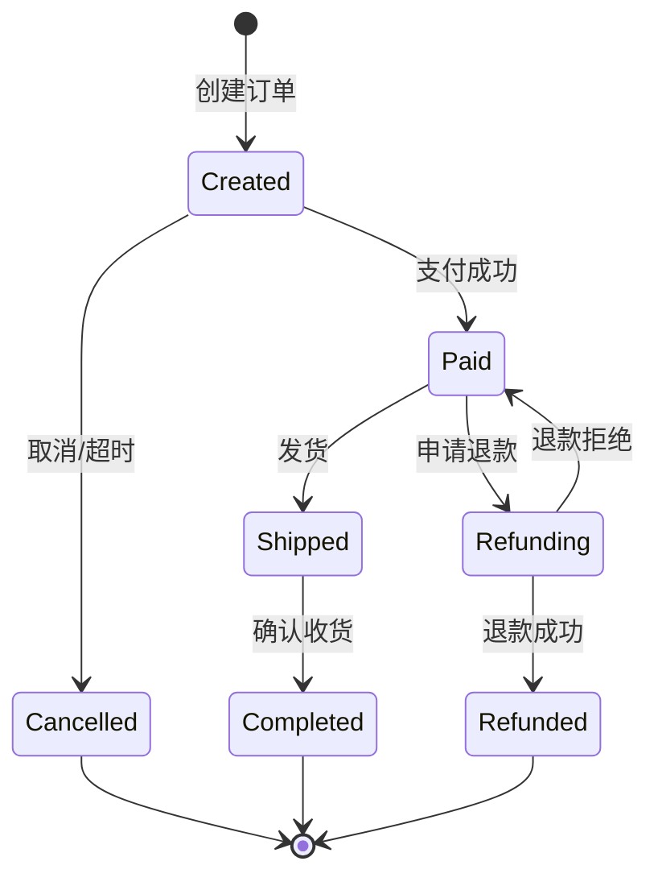
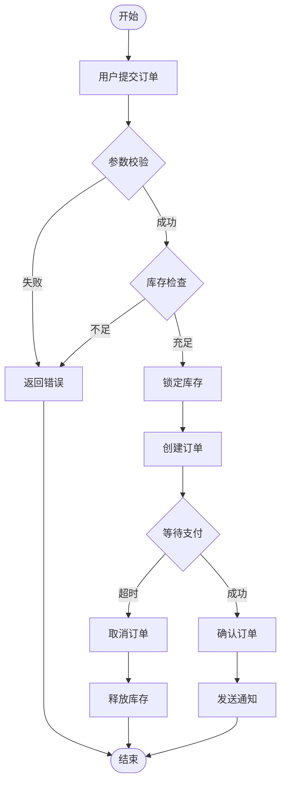

# Architect Skill - 全栈架构师设计助手

## 概述

一个语言无关的全栈架构师助手，帮助设计、评审和文档化软件系统架构。基于业界最佳实践（C4 模型、ADR、12-Factor、微服务模式等），输出完整的架构设计文档，包含流程图、架构图、UML 图、API 设计等。

**适用场景**：创业公司到大型企业，根据团队规模和业务复杂度灵活选择深度。

---

## 触发条件

当用户提到以下关键词时激活：
- "架构设计"、"系统设计"、"architecture"
- "技术选型"、"方案对比"、"ADR"
- "流程图"、"架构图"、"UML"
- "API 设计"、"接口设计"
- "微服务"、"分布式"、"高可用"
- "性能优化"、"扩展性"、"可维护性"

---

## 一、架构师核心职责

### 1.1 架构师做什么

```
┌─────────────────────────────────────────────────────────────┐
│                    架构师核心职责                              │
├─────────────────────────────────────────────────────────────┤
│  1. 需求分析     → 理解业务需求，识别架构关键需求 (ASR)          │
│  2. 架构设计     → 设计系统结构，定义组件和交互                  │
│  3. 技术选型     → 评估技术方案，做出合理决策                    │
│  4. 质量保障     → 确保非功能需求（性能、安全、可用性）           │
│  5. 技术领导     → 指导团队，建立技术标准                       │
│  6. 风险管理     → 识别技术风险，制定缓解策略                    │
│  7. 文档沟通     → 编写架构文档，与利益相关者沟通                 │
└─────────────────────────────────────────────────────────────┘
```

### 1.2 架构关键决策点

| 决策领域 | 关键问题 |
|---------|---------|
| 架构风格 | 单体 vs 微服务 vs Serverless？ |
| 数据管理 | 集中式 vs 分布式数据库？CQRS？事件溯源？ |
| 通信模式 | 同步 vs 异步？REST vs gRPC vs 消息队列？ |
| 部署策略 | 容器化？K8s？多云？ |
| 安全架构 | 认证授权方案？数据加密？ |
| 可观测性 | 日志、指标、链路追踪方案？ |

---

## 二、架构设计流程

### 2.1 完整设计流程



### 2.2 各阶段输出物

| 阶段 | 输出物 | 工具/方法 |
|------|--------|----------|
| 需求分析 | 需求规格、用户故事、ASR | 用例图、用户旅程图 |
| 架构愿景 | 架构愿景文档、约束清单 | 利益相关者分析 |
| 架构设计 | C4 架构图、组件图 | C4 模型、Mermaid |
| 技术选型 | ADR 决策记录 | ADR 模板 |
| 详细设计 | UML 图、API 文档、数据模型 | 类图、序列图、OpenAPI |
| 评审验证 | 评审报告、风险清单 | ATAM、架构评审会 |
| 文档输出 | 完整架构文档 | 架构文档模板 |

---

## 三、C4 架构图模型

### 3.1 四层架构图

```
Level 1: System Context (系统上下文图)
├── 展示系统与外部用户、系统的关系
├── 受众：所有人（技术+非技术）
└── 回答：系统是什么？谁在用？与什么交互？

Level 2: Container (容器图)
├── 展示系统内的应用程序、数据存储、服务
├── 受众：技术人员
└── 回答：系统由哪些技术组件组成？

Level 3: Component (组件图)
├── 展示容器内的组件/模块
├── 受众：开发人员
└── 回答：容器内部如何组织？

Level 4: Code (代码图)
├── 展示组件的类/接口结构
├── 受众：开发人员
└── 回答：代码如何实现？
```

### 3.2 C4 图示例模板

**Level 1 - System Context:**


**Level 2 - Container:**


---

## 四、UML 图类型与使用场景

### 4.1 结构图（静态）

| 图类型 | 用途 | 使用场景 |
|--------|------|---------|
| **类图** | 展示类、接口、关系 | 领域模型、设计模式、代码结构 |
| **对象图** | 展示实例关系 | 调试、示例说明 |
| **组件图** | 展示组件依赖 | 模块划分、服务边界 |
| **部署图** | 展示物理部署 | 运维、基础设施 |
| **包图** | 展示包/模块组织 | 代码组织、依赖管理 |

### 4.2 行为图（动态）

| 图类型 | 用途 | 使用场景 |
|--------|------|---------|
| **用例图** | 展示系统功能 | 需求分析、功能范围 |
| **活动图** | 展示流程/工作流 | 业务流程、算法流程 |
| **状态图** | 展示状态转换 | 订单状态、生命周期 |
| **序列图** | 展示对象交互顺序 | API 调用、消息流 |
| **通信图** | 展示对象协作 | 组件交互 |
| **时序图** | 展示时间约束 | 实时系统、性能分析 |

### 4.3 UML 图模板

**类图示例:**


**序列图示例:**


**状态图示例:**


**活动图/流程图示例:**


---

## 五、架构决策记录 (ADR)

### 5.1 ADR 模板

```markdown
# ADR-{编号}: {决策标题}

## 状态
[提议 | 已接受 | 已废弃 | 已取代]

## 上下文
描述问题背景、约束条件、驱动因素

## 决策
我们决定采用 {方案}

## 理由
- 为什么选择这个方案
- 考虑了哪些替代方案
- 权衡了哪些因素

## 后果
### 正面
- 好处1
- 好处2

### 负面
- 代价1
- 代价2

### 风险
- 风险1及缓解措施

## 相关决策
- ADR-xxx: 相关决策
```

### 5.2 技术选型评估矩阵

```markdown
## 技术选型: {主题}

### 候选方案

| 评估维度 | 权重 | 方案A | 方案B | 方案C |
|---------|------|-------|-------|-------|
| 功能满足度 | 25% | 9 | 8 | 7 |
| 性能 | 20% | 8 | 9 | 7 |
| 可维护性 | 15% | 7 | 8 | 9 |
| 学习成本 | 10% | 6 | 8 | 9 |
| 社区生态 | 10% | 9 | 7 | 6 |
| 成本 | 10% | 7 | 8 | 9 |
| 安全性 | 10% | 8 | 8 | 7 |
| **加权总分** | 100% | **7.85** | **8.05** | **7.55** |

### 结论
推荐方案B，理由：...
```

---

## 六、API 设计规范

### 6.1 RESTful API 设计

```yaml
# OpenAPI 3.0 模板
openapi: 3.0.0
info:
  title: {服务名} API
  version: 1.0.0
  description: API 描述

paths:
  /resources:
    get:
      summary: 获取资源列表
      parameters:
        - name: page
          in: query
          schema:
            type: integer
            default: 1
        - name: limit
          in: query
          schema:
            type: integer
            default: 20
      responses:
        '200':
          description: 成功
          content:
            application/json:
              schema:
                $ref: '#/components/schemas/ResourceList'
    post:
      summary: 创建资源
      requestBody:
        required: true
        content:
          application/json:
            schema:
              $ref: '#/components/schemas/CreateResource'
      responses:
        '201':
          description: 创建成功

  /resources/{id}:
    get:
      summary: 获取单个资源
    put:
      summary: 更新资源
    delete:
      summary: 删除资源

components:
  schemas:
    Resource:
      type: object
      properties:
        id:
          type: string
        name:
          type: string
        createdAt:
          type: string
          format: date-time
```

### 6.2 API 响应格式

```json
// 成功响应
{
  "code": 0,
  "message": "success",
  "data": {
    "id": "123",
    "name": "example"
  },
  "timestamp": "2025-01-06T12:00:00Z",
  "traceId": "abc-123-def"
}

// 错误响应
{
  "code": 40001,
  "message": "Validation failed",
  "errors": [
    {
      "field": "email",
      "message": "Invalid email format"
    }
  ],
  "timestamp": "2025-01-06T12:00:00Z",
  "traceId": "abc-123-def"
}

// 分页响应
{
  "code": 0,
  "message": "success",
  "data": {
    "items": [...],
    "pagination": {
      "page": 1,
      "limit": 20,
      "total": 100,
      "totalPages": 5
    }
  }
}
```

---

## 七、非功能需求设计

### 7.1 质量属性场景模板

```markdown
## 质量属性: {属性名}

### 场景描述
| 要素 | 描述 |
|------|------|
| 刺激源 | 谁/什么触发了这个场景 |
| 刺激 | 具体的触发事件 |
| 环境 | 系统处于什么状态 |
| 制品 | 受影响的系统部分 |
| 响应 | 系统如何响应 |
| 响应度量 | 如何衡量响应是否满足要求 |

### 示例：性能场景
| 要素 | 描述 |
|------|------|
| 刺激源 | 1000 个并发用户 |
| 刺激 | 发起查询请求 |
| 环境 | 正常运行时 |
| 制品 | API 服务 |
| 响应 | 返回查询结果 |
| 响应度量 | 99% 请求在 200ms 内完成 |
```

### 7.2 非功能需求清单

| 类别 | 指标 | 目标值 | 设计策略 |
|------|------|--------|---------|
| **性能** | 响应时间 | P99 < 200ms | 缓存、异步、CDN |
| | 吞吐量 | 10000 QPS | 水平扩展、负载均衡 |
| **可用性** | SLA | 99.9% | 多副本、故障转移 |
| | RTO | < 5min | 自动恢复、健康检查 |
| | RPO | < 1min | 实时备份、多活 |
| **可扩展性** | 水平扩展 | 线性扩展 | 无状态设计、分片 |
| **安全性** | 认证 | OAuth2/JWT | 统一认证中心 |
| | 加密 | TLS 1.3 | 传输加密、存储加密 |
| **可观测性** | 日志 | 集中收集 | ELK/Loki |
| | 指标 | 实时监控 | Prometheus/Grafana |
| | 追踪 | 分布式追踪 | Jaeger/Zipkin |

---

## 八、架构模式参考

### 8.1 常用架构模式

```
┌─────────────────────────────────────────────────────────────┐
│                     架构模式选择指南                          │
├─────────────────────────────────────────────────────────────┤
│                                                             │
│  单体架构 ──────────────────────────────────────────────────│
│  适用：小团队、简单业务、快速验证                              │
│  优点：简单、部署容易、调试方便                               │
│  缺点：扩展性差、技术栈单一                                   │
│                                                             │
│  微服务架构 ────────────────────────────────────────────────│
│  适用：大团队、复杂业务、独立部署需求                          │
│  优点：独立扩展、技术多样性、故障隔离                          │
│  缺点：复杂度高、运维成本高                                   │
│                                                             │
│  事件驱动架构 ──────────────────────────────────────────────│
│  适用：异步处理、解耦、实时数据流                              │
│  优点：松耦合、可扩展、实时性                                 │
│  缺点：调试困难、最终一致性                                   │
│                                                             │
│  CQRS + 事件溯源 ───────────────────────────────────────────│
│  适用：复杂领域、审计需求、高并发读写分离                       │
│  优点：读写优化、完整历史、可重放                              │
│  缺点：复杂度高、学习曲线陡                                   │
│                                                             │
│  Serverless ────────────────────────────────────────────────│
│  适用：事件触发、不规则流量、快速上线                          │
│  优点：按需付费、自动扩展、无运维                              │
│  缺点：冷启动、厂商锁定、调试困难                              │
│                                                             │
└─────────────────────────────────────────────────────────────┘
```

### 8.2 微服务模式清单

| 类别 | 模式 | 用途 |
|------|------|------|
| **服务拆分** | 按业务能力拆分 | 根据业务领域划分服务 |
| | 按子域拆分 | DDD 限界上下文 |
| **数据管理** | Database per Service | 每服务独立数据库 |
| | Saga | 分布式事务 |
| | CQRS | 读写分离 |
| | Event Sourcing | 事件溯源 |
| **通信** | API Gateway | 统一入口 |
| | BFF | 前端专用后端 |
| | 服务网格 | Sidecar 代理 |
| **可靠性** | Circuit Breaker | 熔断器 |
| | Retry | 重试 |
| | Bulkhead | 舱壁隔离 |
| **可观测性** | 分布式追踪 | 链路追踪 |
| | 日志聚合 | 集中日志 |
| | 健康检查 | 服务健康 |

### 8.3 12-Factor App 原则

| # | 原则 | 说明 |
|---|------|------|
| 1 | Codebase | 一份代码，多处部署 |
| 2 | Dependencies | 显式声明依赖 |
| 3 | Config | 配置存储在环境变量 |
| 4 | Backing Services | 后端服务作为附加资源 |
| 5 | Build, Release, Run | 严格分离构建和运行 |
| 6 | Processes | 无状态进程 |
| 7 | Port Binding | 通过端口绑定提供服务 |
| 8 | Concurrency | 通过进程模型扩展 |
| 9 | Disposability | 快速启动和优雅终止 |
| 10 | Dev/Prod Parity | 保持环境一致性 |
| 11 | Logs | 日志作为事件流 |
| 12 | Admin Processes | 管理任务作为一次性进程 |

---

## 九、异常处理设计

### 9.1 异常分类

```
异常体系
├── 业务异常 (BusinessException)
│   ├── 参数校验异常 (ValidationException)
│   ├── 业务规则异常 (BusinessRuleException)
│   └── 资源不存在异常 (ResourceNotFoundException)
├── 系统异常 (SystemException)
│   ├── 数据库异常 (DatabaseException)
│   ├── 网络异常 (NetworkException)
│   └── 第三方服务异常 (ExternalServiceException)
└── 未知异常 (UnknownException)
```

### 9.2 错误码设计

```
错误码格式: {服务代码}{模块代码}{错误序号}

示例:
- 100001: 用户服务-认证模块-用户不存在
- 100002: 用户服务-认证模块-密码错误
- 200001: 订单服务-订单模块-订单不存在
- 200002: 订单服务-支付模块-支付失败

HTTP 状态码映射:
- 400: 参数错误、业务规则错误
- 401: 未认证
- 403: 无权限
- 404: 资源不存在
- 409: 冲突（并发修改）
- 429: 限流
- 500: 系统内部错误
- 502: 网关错误
- 503: 服务不可用
```

---

## 十、完整架构文档模板

### 10.1 文档结构

```markdown
# {系统名称} 架构设计文档

## 文档信息
| 项目 | 内容 |
|------|------|
| 版本 | v1.0 |
| 作者 | xxx |
| 日期 | 2025-01-06 |
| 状态 | 草稿/评审中/已批准 |

## 修订历史
| 版本 | 日期 | 作者 | 变更说明 |
|------|------|------|---------|
| 1.0 | 2025-01-06 | xxx | 初稿 |

---

## 1. 概述
### 1.1 背景与目标
### 1.2 范围
### 1.3 术语定义
### 1.4 参考文档

## 2. 需求分析
### 2.1 功能需求
### 2.2 非功能需求
### 2.3 约束条件
### 2.4 假设

## 3. 架构设计
### 3.1 架构愿景
### 3.2 架构原则
### 3.3 系统上下文图 (C4 Level 1)
### 3.4 容器图 (C4 Level 2)
### 3.5 组件图 (C4 Level 3)
### 3.6 部署架构图

## 4. 详细设计
### 4.1 业务流程图
### 4.2 领域模型 (类图)
### 4.3 核心序列图
### 4.4 状态机设计
### 4.5 数据模型 (ER图)

## 5. 接口设计
### 5.1 API 概览
### 5.2 API 详细定义
### 5.3 消息格式
### 5.4 错误码定义

## 6. 技术选型
### 6.1 技术栈总览
### 6.2 关键决策 (ADR)

## 7. 非功能设计
### 7.1 性能设计
### 7.2 可用性设计
### 7.3 安全设计
### 7.4 可观测性设计

## 8. 风险与缓解
### 8.1 技术风险
### 8.2 缓解策略

## 9. 附录
### 9.1 ADR 列表
### 9.2 参考资料
```

---

## 使用方式

### 架构设计
```
帮我设计一个 [系统名称] 的架构，需求是 [需求描述]
```

### 技术选型
```
帮我做 [技术A] vs [技术B] vs [技术C] 的选型对比，场景是 [场景描述]
```

### 画架构图
```
帮我画 [系统名称] 的 [C4上下文图/容器图/组件图/序列图/类图/流程图]
```

### API 设计
```
帮我设计 [功能] 的 RESTful API，包含请求响应格式
```

### 架构评审
```
评审这个架构设计，检查 [性能/安全/可用性/可维护性] 方面的问题
```

---

## 输出要求

1. **图文并茂**: 每个设计必须包含 Mermaid 图
2. **完整性**: 包含流程图、架构图、UML 图、API 定义
3. **可执行**: 代码示例可直接使用
4. **决策记录**: 重要决策使用 ADR 格式记录
5. **质量属性**: 明确非功能需求和设计策略
6. **风险识别**: 识别技术风险并提供缓解方案

---

## 参考资源

- [C4 Model](https://c4model.com/) - 架构图方法论
- [ADR](https://adr.github.io/) - 架构决策记录
- [12-Factor App](https://12factor.net/) - 云原生应用原则
- [Microservices Patterns](https://microservices.io/) - 微服务模式
- [Martin Fowler](https://martinfowler.com/architecture/) - 架构最佳实践
