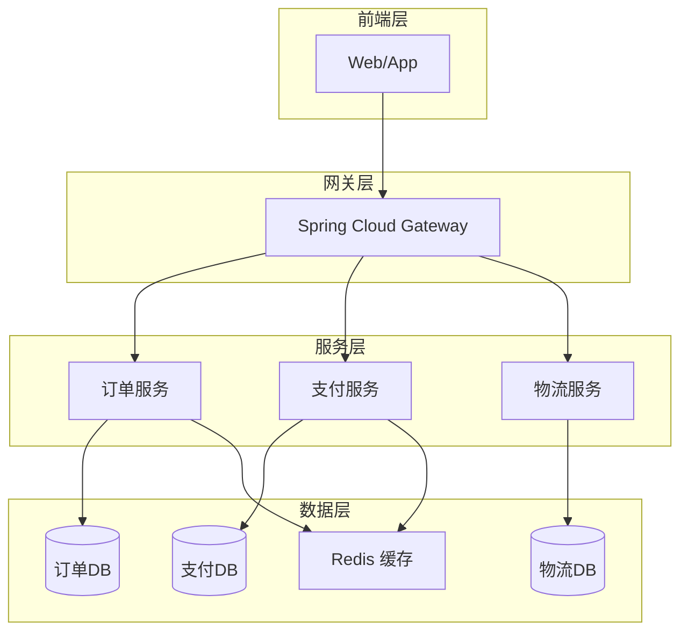

# 技术方案文档标准模板

本模板为技术架构方案的标准输出格式,面向技术 Leader,兼顾技术深度与决策便利性。

---

# 【方案名称】技术方案

> **文档版本**: v1.0  
> **编制日期**: YYYY-MM-DD  
> **面向对象**: 技术 Leader / 架构委员会

## 一、背景与目标

### 1.1 业务背景

简要描述业务场景和当前系统现状 (2-3句话)。

**示例**:
当前订单系统日均处理订单 50 万笔,高峰期 TPS 达到 5000。现有单体架构在促销活动期间频繁出现响应延迟,影响用户体验。

### 1.2 问题陈述

明确要解决的技术问题 (列表形式)。

**示例**:
- 单体应用扩展性受限,无法水平扩展
- 核心业务与非核心业务耦合,故障影响范围大
- 部署周期长,无法快速响应业务需求

### 1.3 目标与约束

**业务目标**:
- 目标 1: 支持 3 倍业务增长
- 目标 2: 关键接口响应时间 < 200ms

**技术约束**:
- 团队规模: 20 人,Java 开发经验 2-5 年
- 时间窗口: 6 个月完成迁移
- 预算: 基础设施成本增加 < 30%

## 二、方案对比分析

### 2.1 候选方案概述

| 方案 | 核心思路 | 主要技术栈 |
|------|---------|-----------|
| 方案 A | 简要描述 | Spring Boot, XXX |
| 方案 B | 简要描述 | Spring Cloud, YYY |
| 方案 C | 简要描述 | Dubbo, ZZZ |

### 2.2 多维度对比

| 对比维度 | 方案 A | 方案 B | 方案 C |
|---------|-------|-------|-------|
| **技术成熟度** | ★★★★☆<br>社区活跃,案例丰富 | ★★★☆☆<br>较新,案例有限 | ★★★★★<br>久经考验 |
| **与现有栈集成** | ★★★★★<br>完全兼容 Spring Boot 3.2.4 | ★★★☆☆<br>需适配部分组件 | ★★☆☆☆<br>需重构大量代码 |
| **团队技能匹配** | ★★★★☆<br>学习成本低 | ★★★☆☆<br>需培训 2 周 | ★★☆☆☆<br>需培训 1 个月 |
| **性能指标** | TPS: 8000<br>延迟: 150ms | TPS: 10000<br>延迟: 100ms | TPS: 12000<br>延迟: 80ms |
| **运维复杂度** | ★★★☆☆<br>中等 | ★★★★☆<br>较高 | ★★☆☆☆<br>低 |
| **成本** | +25% 基础设施 | +40% 基础设施 | +15% 基础设施 |

**评分说明**: ★ 表示该维度的适配程度,5 星为最优

### 2.3 优劣势总结

#### 方案 A
**优势**:
- 优势点 1
- 优势点 2

**劣势**:
- 劣势点 1
- 劣势点 2

#### 方案 B
(类似结构)

#### 方案 C
(类似结构)

## 三、推荐方案

### 3.1 方案选择

**推荐方案**: 【方案 X】

**推荐理由** (1-2 段):
综合考虑技术成熟度、团队能力和成本约束,推荐方案 X。该方案在满足性能目标的同时,与现有技术栈兼容性最佳,团队学习成本最低,可在时间窗口内完成落地。

### 3.2 理论依据

引用架构原则和最佳实践支撑推荐方案。

**示例**:
- **康威定律**: 系统架构应与组织结构匹配。当前团队采用业务域划分,微服务架构与之契合。
- **单一职责原则 (SRP)**: 将订单、支付、物流拆分为独立服务,降低耦合度。
- **CAP 理论**: 本场景重视可用性 (A) 和分区容错 (P),可接受最终一致性,选择 AP 模型。

**行业案例**:
- 某电商公司类似场景采用微服务架构,TPS 提升 3 倍,故障恢复时间从小时级降至分钟级。

### 3.3 技术架构

#### 3.3.1 架构图



#### 3.3.2 关键技术点

**服务注册与发现**:
- 技术选型: Nacos 2.x
- 集成方式: Spring Cloud Alibaba
- 配置示例:
```yaml
spring:
  cloud:
    nacos:
      discovery:
        server-addr: ${NACOS_SERVER:localhost:8848}
```

**服务间通信**:
- 同步调用: OpenFeign (HTTP) 或 Dubbo (RPC)
- 异步通信: RocketMQ / Kafka
- 选择依据: 核心链路用 Dubbo,非核心链路用 HTTP

**分布式事务**:
- 方案: Seata AT 模式
- 适用场景: 订单创建 + 库存扣减
- 降级策略: 最终一致性 + 补偿机制

**配置管理**:
- 沿用 Apollo 2.2.0 (已有积累)
- 迁移注意事项: 配置按服务拆分

**缓存策略**:
- 继续使用 Redisson 3.11.6
- 缓存模式: Cache-Aside Pattern
- 热点数据预热: 使用 Caffeine 作为本地缓存

### 3.4 POC 验证结果

**验证场景**: 高并发订单创建

**测试环境**:
- 服务器: 4C8G * 3
- 并发线程: 500
- 持续时间: 5 分钟

**关键指标**:

| 指标 | 当前架构 | 方案 A (推荐) | 目标值 |
|------|---------|--------------|-------|
| TPS | 3200 | 8500 | > 5000 |
| P95 延迟 | 380ms | 160ms | < 200ms |
| P99 延迟 | 850ms | 280ms | < 500ms |
| 错误率 | 0.8% | 0.05% | < 0.1% |

**结论**: 方案 A 满足性能目标,且留有 70% 性能余量。

**POC 代码位置**: 见附录或单独代码文件

## 四、实施路径

### 4.1 分阶段计划

| 阶段 | 时间 | 目标 | 关键里程碑 |
|------|------|------|----------|
| **阶段一: 基础设施准备** | 1-2 个月 | 搭建微服务基础设施 | - Nacos 集群部署<br>- 网关配置完成<br>- 监控体系建立 |
| **阶段二: 核心服务拆分** | 3-4 个月 | 拆分订单、支付服务 | - 订单服务上线<br>- 支付服务上线<br>- 灰度验证通过 |
| **阶段三: 全量迁移** | 5-6 个月 | 其他服务迁移 | - 所有服务拆分完成<br>- 旧系统下线 |

### 4.2 技术风险与应对

| 风险 | 影响 | 概率 | 应对措施 |
|------|------|------|---------|
| **分布式事务一致性问题** | 高 | 中 | - 采用 Seata 保证强一致<br>- 关键业务增加人工审核兜底 |
| **服务依赖过多导致雪崩** | 高 | 低 | - 实施熔断降级 (Sentinel)<br>- 限流保护核心服务 |
| **数据迁移数据丢失** | 中 | 低 | - 双写验证<br>- 增量同步 + 对账 |
| **团队技能不足** | 中 | 中 | - 提前培训 2 周<br>- 外部专家支持 |

### 4.3 回滚方案

**灰度发布策略**:
- 先 5% 流量 → 观察 1 周
- 再 20% 流量 → 观察 3 天
- 全量切换

**回滚条件**:
- 错误率 > 1%
- P99 延迟 > 500ms 持续 10 分钟
- 出现资损或数据不一致

**回滚方式**:
- 通过网关配置秒级切回旧系统
- 保留旧系统 3 个月作为备份

## 五、资源评估

### 5.1 开发工作量

| 任务 | 工作量 (人天) | 负责团队 |
|------|-------------|---------|
| 基础设施搭建 | 20 | 架构组 |
| 订单服务拆分 | 40 | 订单团队 |
| 支付服务拆分 | 30 | 支付团队 |
| 物流服务拆分 | 25 | 物流团队 |
| 测试与联调 | 30 | QA 团队 |
| **总计** | **145 人天** | - |

**投入人力**: 约 3 个全职开发 + 1 个 QA,持续 6 个月

### 5.2 技能要求

| 技能 | 要求级别 | 当前团队水平 | 差距 |
|------|---------|-------------|------|
| Spring Boot 3.x | 熟练 | 熟练 | 无 |
| Spring Cloud | 熟练 | 了解 | 需培训 |
| 分布式事务 | 了解 | 不熟悉 | 需培训 |
| 微服务监控 | 了解 | 不熟悉 | 需培训 |

**培训计划**: 2 周集中培训 + 外部专家 code review

### 5.3 基础设施成本

| 资源 | 现有成本 | 新增成本 | 增幅 |
|------|---------|---------|------|
| 服务器 (ECS) | ¥8,000/月 | ¥10,000/月 | +25% |
| 数据库 (RDS) | ¥5,000/月 | ¥6,000/月 | +20% |
| 中间件 (Redis/MQ) | ¥2,000/月 | ¥3,000/月 | +50% |
| **合计** | **¥15,000/月** | **¥19,000/月** | **+27%** |

**结论**: 成本增加符合预算约束 (< 30%)

## 六、附录

### 6.1 参考资料

- [Spring Boot 3.2 官方文档](https://spring.io/projects/spring-boot)
- [Spring Cloud 2023 官方文档](https://spring.io/projects/spring-cloud)
- 《微服务架构设计模式》- Chris Richardson
- 阿里云微服务架构最佳实践

### 6.2 POC 代码示例

(如有必要,附上关键代码片段或单独的代码文件)

### 6.3 变更记录

| 版本 | 日期 | 修改人 | 修改内容 |
|------|------|-------|---------|
| v1.0 | 2024-XX-XX | 架构师 | 初始版本 |

---

**审批意见**:

| 角色 | 姓名 | 意见 | 签字 | 日期 |
|------|------|------|------|------|
| 技术 Leader | | | | |
| 架构委员会 | | | | |
| CTO | | | | |
